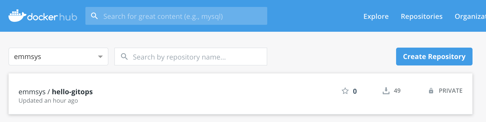
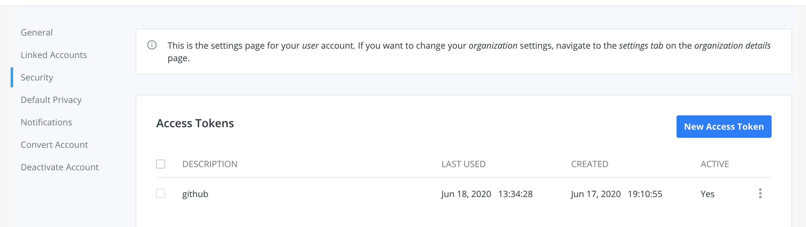
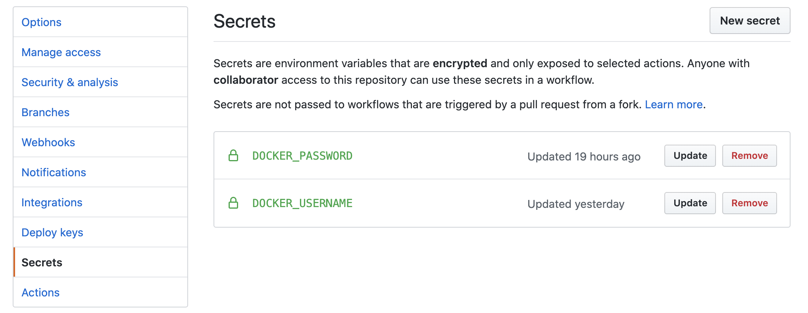
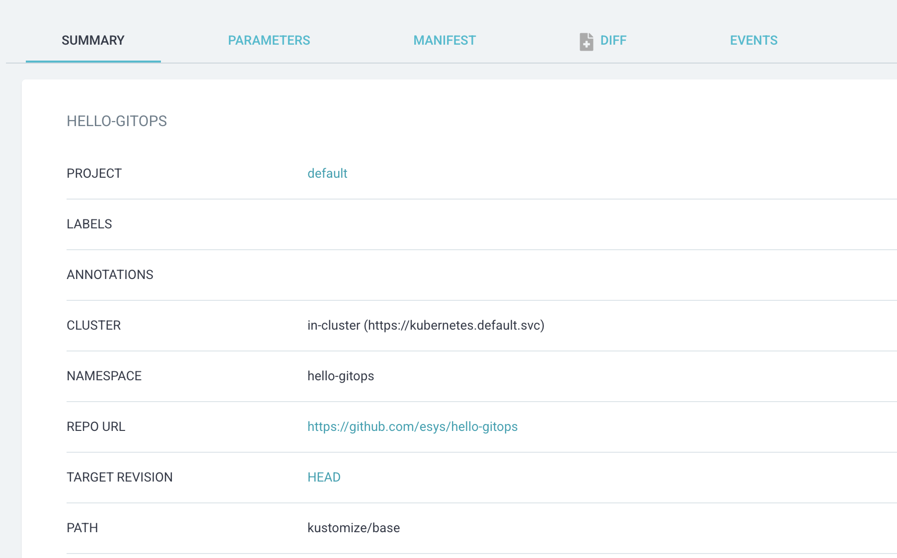

# Workshop Hello GitOps

Example project to demonstrate GitOps using [Kustomize](https://github.com/kubernetes-sigs/kustomize), GitHub Actions and [ArgoCD](https://github.com/argoproj/argo-cd/)

- [What we want to achieve](#what-we-want-to-achieve)
- [Setup Minikube](#setup-minikube)
- [Setup ArgoCD](#setup-argocd)
- [Setup DockerHub](#setup-dockerhub)
- [Setup GitHub](#setup-github)
- [Configure ArgoCD](#configure-argocd)
- [Test the application](#test-the-application)
  
## What we want to achieve

1. Code change is made to a Go application and pushed to master
1. GitHub Actions workflow is triggered
1. Code is first unit tested
1. If tests are OK, the application is packaged as a Docker image and pushed to DockerHub
1. The kustomize manifests are edited to reference this new image tag
1. Kustomize changes are committed and pushed automatically by the workflow
1. As kustomize files have changed, ArgoCD synchronize the application state with the Kubernetes cluster to deploy or update the app

To implement this scenario, we will use [Minikube](https://github.com/kubernetes/minikube) as the Kubernetes cluster.

## Setup Minikube

- Install Minikube with on MacOS with default driver (hyperkit)

```
brew install minikube
minikube start
```

- Create the K8s namespaces we will use
```
kubectl create ns hello-gitops
kubectl create ns argocd
```

- Enable the ingress controller (nginx)

```
minikube addons enable ingress
```


## Setup ArgoCD

Refer to the official [setup instructions](https://argoproj.github.io/argo-cd/getting_started/) for a detailed guide.
To sum it up
```
kubectl apply -n argocd -f https://raw.githubusercontent.com/argoproj/argo-cd/stable/manifests/install.yaml
```

ArgoCD can be interacted with using
- the web UI
- the ArgoCD CLI
- or by editing the CRD yaml

If you want to install the CLI 
```
brew tap argoproj/tap
brew install argoproj/tap/argocd 
```

For this example, we will use the web UI. It can be made accessible using a port forward
```
kubectl port-forward svc/argocd-server -n argocd 8080:443
```

Check you have access to the web UI at http://localhost:8080 using your browser
- Username is `admin`
- Default password can be retrieved by running `kubectl get pods -n argocd -l app.kubernetes.io/name=argocd-server -o name | cut -d'/' -f 2`

You are of course encouraged to change this password

## Setup DockerHub

Login to your DockerHub account and create a new repository by clicking `Create Repository`



It's easier to make the repository public. If you want to use a private repository (like I did) you will need to allow your Minikube cluster to pull image from this repo by creating a secret. Procedure is explained later.

You will also need to generate a token for use by GitHub by going into your account settings then Security and clicking `New Access Token`



## Setup GitHub 

### Fork the repository

- First, fork this repository by using the GitHub `Fork` button

- Then clone your new forked repository
```
git clone https://github.com/<your-username>/hello-gitops.git

```
- Then add the `hello-gitops` repository as upstream
```
cd hello-gitops
git remote add upstream https://github.com/esys/hello-gitops.git
```

- Update your fork 
```
git pull upstream master
```

### Configure GitHub Actions

You will need to expose your DockerHub credentials as GitHub secrets. 

- From your forked project page, click on `Settings` then `Secrets`



- Create two new secrets `DOCKER_USERNAME` and `DOCKER_PASSWORD` (Docker password is the previously generated token for github on DockerHub)
- Check the `.github/workflows/go.yml` to check parameters and familiarize yourself with the workflow
  - Checkout the code
  - Unit test it
  - Build and push the application as a Docker image
  - Update the Kustomize manifest with the new Docker tag

### Take a look at Kustomize

Kustomize manifests are in the `kustomize` folder. 
The `kustomization.yaml` is updated automatically by the GitHub workflow to add a new `images` transformation setting the right image name and tag.
```
images:
- name: hello-gitops
  newTag: baadd7d7832f74e3c6d37b3f07b179d7e86c4017
  newName: emmsys/hello-gitops
```

No need to touch these settings as they are updated by the workflow.

### Allow Minikube to pull the Docker image

#### Option 1 : your DockerHub repository is public

Edit `kustomize/base/deployment.yaml` to remove any reference to an `imagePullSecrets`

```
    spec:
      containers:
        - image: hello-gitops
          name: hello-gitops
          ports:
            - name: http
              containerPort: 8080
```

Note: you can also make these changes with a Kustomize patch in a new overlay

#### Option 2 : your DockerHub repository is private

You will need to create a DockerHub token to allow Minikube pulling this images
- Login to DockerHub website and create a new token in the security settings like we did for GitHub
- Create a Kubernetes secrets with these credentials in the Kubernetes application namespace
```
kubectl -n hello-gitops create secret docker-registry my-registry-creds --docker-server="https://index.docker.io/v1/" --docker-username="YOUR_USERNAME" --docker-password="YOUR_DOCKER_TOKEN" --docker-email="YOUR@EMAIL"
```
- Edit `kustomize/base/deployment.yaml` to reference this secret as an `imagePullSecrets`
```
    spec:
      containers:
        - image: hello-gitops
          name: hello-gitops
          ports:
            - name: http
              containerPort: 8080
      imagePullSecrets:
      - name: my-registry-creds
```

### Commit your changes

At this point, you should certainly have made code changes. 

Commit and push them
```
git commit -am "customized settings"
git push origin master
```

## Configure ArgoCD

At the end of the workflow, Kustomize manifests are referencing the newly built Docker image. We will configure ArgoCD to observe changes to Kustomize files and update the application in the K8s cluster.
- Login to ArgoCD
- See [the official documentation](https://argoproj.github.io/argo-cd/getting_started/) for a step by step guide
- You will need to enter 
  - your forked GitHub repository address
  - `HEAD` or `master` revision
  - `kustomize/base` as the `Path` parameter
  - `hello-gitops` as namespace
- Application configuration should look like this



- If you've pickup up manual synchronization, click the `Sync` button
- Your application should be deployed properly in the Minikube cluster


- You can make some code changes in the project, ArgoCD should catch the changes and redeploy (or detect out of sync if using manual synchronization)

## Test the application

Application is reachable on port 8080 inside the cluster. It displays a simple Hello World string with the hostname.

You can reach it through a port forward command 
```
kubectl -n hello-gitops port-forward $(kubectl -n hello-gitops get po -o name) 8111:8080
curl localhost:8111
# Hello from hello-gitops-6f7d4878c9-qg4l6
```

Or by using the ingress controller 
```
INGRESS_IP=`kubectl -n hello-gitops get ingress -o jsonpath='{.items[0].status.loadBalancer.ingress[0].ip}'`
curl $INGRESS_IP
# Hello from hello-gitops-6f7d4878c9-qg4l6
```
